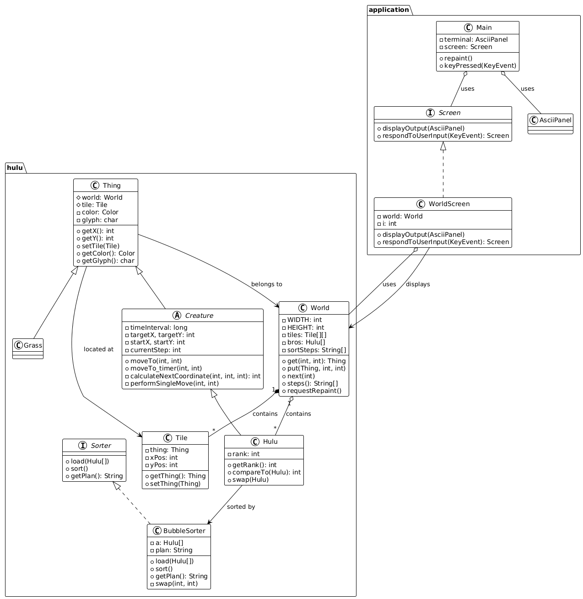

# J01

本次作业已全部完成，这是一个修改后的README.md

## 任务一

使用plantuml画出`hulu`目录代码的uml图(位于./uml/hulu-class.svg)，最终效果如下：

绘制过程如下：
* Creature和Grass都继承于Thing，Hulu继承于Creature
* Tile上面存在不同种类的Thing，Thing在world中。
* Hulu，Tile，Grass都存在于world中
* BubbleSorter是接口Sorter的实现，一个BubbleSorter有多个Hulu（用于排序）
* Screen用来显示当前情况，利用repaint进行重新绘制。

面向对象设计分析：
1. 类的职责分离
* Thing: 所有游戏实体的类，封装了位置、颜色等属性
* Creature: 抽象生物类，扩展Thing并添加移动能力
* Hulu: 葫芦娃类，具有排名和交换能力
* Grass: 环境实体，代表草地
* Tile: 网格单元，管理每个位置上的实体
2. 继承与多态
* Thing → Creature → Hulu
* Thing → Grass
* Sorter ← BubbleSorter
* Screen ← WorldScreen
3. 封装性
* 每个类都封装了特定的功能：Thing封装了实体的基本属性，World封装了世界状态管理，BubbleSorter封装了排序算法细节

## 任务二

现在，两个葫芦娃交换位置的方式与现实中一致，即从两边缓缓交换，过程中不相重叠，具体实现效果如下：  

[j01_task2视频链接](https://www.bilibili.com/video/BV1Z8aYzXEV6/)

## 任务三

实现了插入排序（InsertionSorter），每个未排序的元素都与前面的元素逐个相比较，不断交换直至自己应有的位置，葫芦娃的行为符合现实世界规则，具体实现效果如下： 

[j01_task3视频链接](https://www.bilibili.com/video/BV1B7aBzTERz/)

**所有任务已完成，运行过程录屏发布在小破站。**
